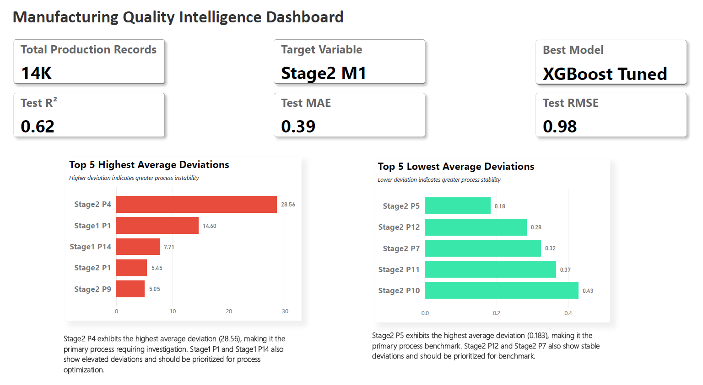
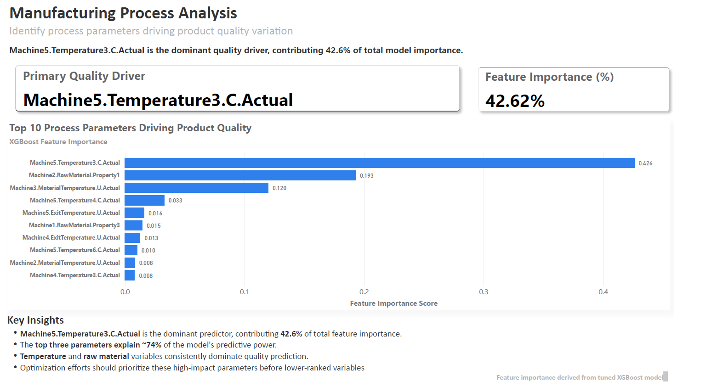
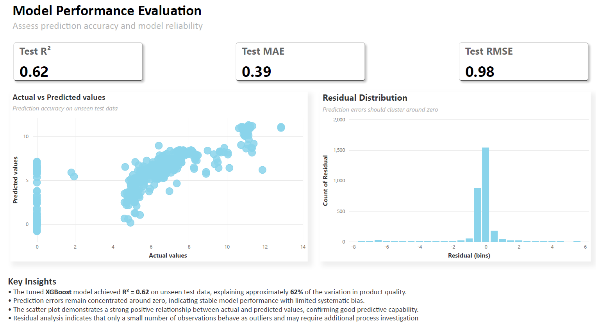
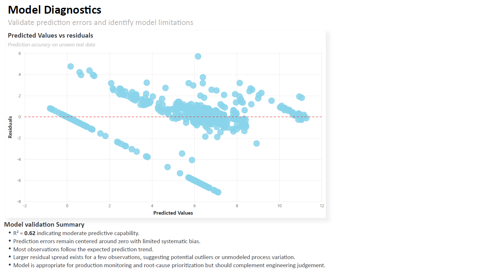

# 🏭 Manufacturing Quality Intelligence

An end-to-end Manufacturing Data Analytics and Machine Learning project that combines **SQL, Python, XGBoost, Power BI, and Manufacturing Domain Knowledge** to identify quality drivers, predict production outcomes, and support process optimization.

---

## 📌 Business Problem

Manufacturing plants continuously collect process parameters from multiple machines and production stages.

The challenge is identifying:

- Which process variables have the greatest influence on final product quality.
- Which production stages require immediate engineering attention.
- Whether machine learning can accurately predict product quality before production completion.
- How engineers can monitor these insights through an interactive dashboard.

This project demonstrates a complete analytics workflow from raw manufacturing data to business-ready insights.

## 📖 Project Overview

This project demonstrates a complete industrial analytics workflow covering:

- Data Quality Assessment using SQL
- Manufacturing Process Analysis
- Root Cause Analysis
- Machine Learning Model Development
- Feature Importance Interpretation
- Interactive Business Dashboard in Power BI

The objective is not only to build a predictive model but also to provide actionable insights that manufacturing engineers can use for process improvement.

## 🛠 Tech Stack

| Category | Tools |
|----------|------|
| Programming | Python |
| Data Processing | Pandas, NumPy |
| Machine Learning | Scikit-learn, XGBoost |
| Database | SQL |
| Data Visualization | Power BI, Matplotlib, Seaborn |
| Model Persistence | Pickle |
| Notebook Environment | Jupyter Notebook |

## 🔄 Project Workflow

```text
Raw Manufacturing Data
        │
        ▼
SQL Data Health Checks
        │
        ▼
Quality Deviation Analysis
        │
        ▼
Process Root Cause Analysis
        │
        ▼
Python Data Cleaning
        │
        ▼
Feature Engineering
        │
        ▼
XGBoost Model Training
        │
        ▼
Model Evaluation
        │
        ▼
Feature Importance Analysis
        │
        ▼
Power BI Dashboard
```

## 📂 Repository Structure

```text
Manufacturing-Quality-Intelligence
│
├── data
│   ├── raw
│   └── processed
│
├── notebooks
│   ├── 01_Data_Health_Report.ipynb
│   ├── 02_SQL_Insights_Summary.ipynb
│   └── 03_Data_Preprocessing_and_Model_Training.ipynb
│
├── sql
│   ├── 01_Data_Health_Report.sql
│   ├── 02_Quality_Deviation_Analysis.sql
│   ├── 03_Process_Analysis.sql
│   └── 04_Root_Cause_Analysis.sql
│
├── outputs
│
├── models
│
├── powerbi
│   └── screenshots
│
├── README.md
└── requirements.txt
```

## 📊 Power BI Dashboard

The Power BI dashboard converts analytical findings into business insights through four dedicated pages.

### Executive Overview

- Production summary KPIs
- Best performing ML model
- Model accuracy metrics
- Highest and lowest quality deviation process points

---

### Manufacturing Process Analysis

- Top process variables influencing product quality
- Feature importance ranking
- Engineering interpretation of dominant process parameters

---

### Model Performance Evaluation

- Actual vs Predicted comparison
- Error distribution
- Overall regression performance

---

### Model Diagnostics

- Residual analysis
- Model validation summary
- Error pattern investigation

## 🎯 Key Results

- Developed an XGBoost regression model for manufacturing quality prediction.
- Achieved **R² = 0.62** on unseen test data.
- Identified the most influential manufacturing parameters affecting quality.
- Combined SQL analytics with machine learning to support root-cause analysis.
- Built an interactive Power BI dashboard for engineering decision-making.

## 💼 Business Value

This solution helps manufacturing teams to:

- Identify critical process variables affecting quality.
- Prioritize engineering investigations.
- Monitor process stability through interactive dashboards.
- Reduce manual analysis using predictive analytics.
- Support data-driven manufacturing decisions.

## 🚀 Skills Demonstrated

### Data Analytics
- SQL Data Validation
- Root Cause Analysis
- Manufacturing Process Analysis
- Exploratory Data Analysis (EDA)

### Machine Learning
- Regression Modeling
- XGBoost
- Feature Importance Analysis
- Hyperparameter Tuning
- Model Evaluation

### Business Intelligence
- KPI Dashboard Design
- Interactive Power BI Reports
- Executive Reporting
- Data Storytelling

### Python
- Pandas
- NumPy
- Scikit-learn
- Matplotlib
- Seaborn

## 📸 Dashboard Preview

### Executive Overview



---

### Manufacturing Process Analysis



---

### Model Performance



---

### Model Diagnostics



## ⚙ Installation

Clone the repository

```bash
git clone https://github.com/yourusername/Manufacturing-Quality-Intelligence.git
```

Install dependencies

```bash
pip install -r requirements.txt
```

Launch Jupyter Notebook

```bash
jupyter notebook
```

## ⭐ Project Highlights

✔ End-to-End Manufacturing Analytics Project

✔ SQL + Python + Machine Learning + Power BI

✔ Real Manufacturing Dataset (~14,000 Records)

✔ Predictive Quality Modeling using XGBoost

✔ Executive Dashboard for Business Decision Support

## 🔮 Future Improvements

- Real-time manufacturing monitoring
- Model deployment using FastAPI
- Automated retraining pipeline
- MLOps integration
- Predictive maintenance extension
- SPC (Statistical Process Control) integration

- ## 👤 Author

**Vaibhav Sharma**

- LinkedIn: linkedin.com/in/vaibhav-sharma30
- GitHub: https://github.com/vaibhav3098

✔ Feature Importance driven Process Optimization
